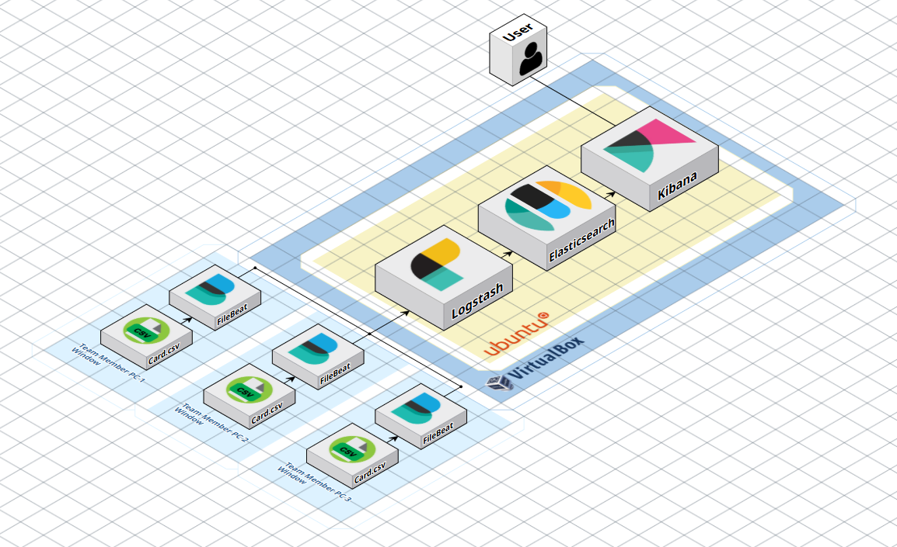
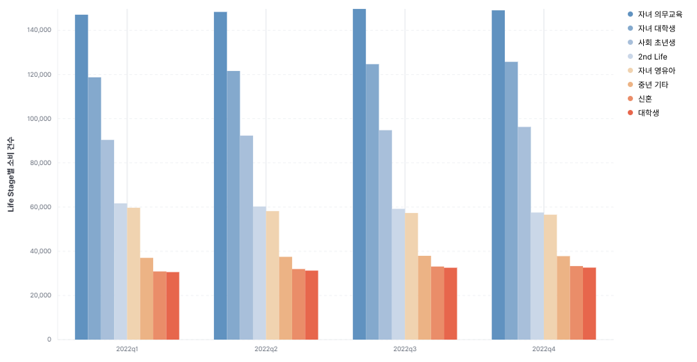
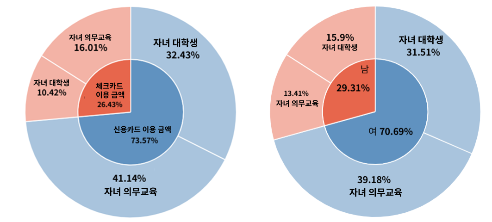
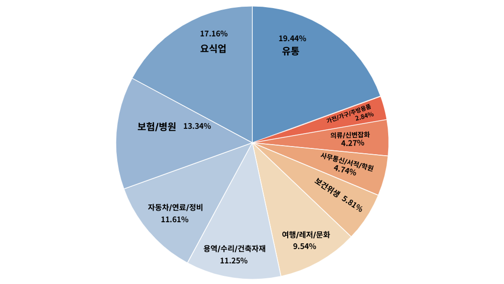

# Plz Don't Go


Life Stage (대학생, 신혼, 은퇴자 등) 기준으로 분기별 소비 건수 추이를 통해 이탈 가능성이 있는 소비층을 분석했습니다.


Ubuntu 가상 머신에 ELK 스택(Elasticsearch, Logstash, Kibana)을 설치하여 카드 데이터에 대한 시각화를 진행했습니다.

> Filebeat → Logstash → Elasticsearch → Kibana 파이프라인을 구축
> 
> VirtualBox 기반 내부망(LAN) 접속
> 
> 보안 고려를 통해 공인 IP 포트는 열지 않음
> 

---

## **👥 팀원 소개**

|  |  |  |
| --- | --- | --- |
| **고태우 (팀장)** | **임유진** | **정서현** |
| [@kohtaewoo](https://github.com/kohtaewoo) | [@imewuzin](https://github.com/imewuzin) | [@hyunn522](https://github.com/hyunn522) |


## 🧱 시스템 아키텍처




| 구성 요소 | 설명 |
| --- | --- |
| **Elasticsearch (v7.11.2)** | 로그 데이터를 저장하고 검색 |
| **Logstash (v7.11.2)** | 수신된 로그를 필터링/정제 |
| **Kibana (v7.11.2)** | Elasticsearch 데이터를 시각화 |
| **Filebeat (v7.11.2)** | CSV 로그 파일을 실시간으로 전송 |
| **Ubuntu (v24.04.2)** | ELK 파이프라인 구축을 위한 가상 환경 |

> ✅ VirtualBox는 "브리지 어댑터"로 설정하여 동일 네트워크에서 접속 가능하게 구성했습니다.

---

<details>
   
<summary><h2>🛠️ 설치 및 설정 절차</h2></summary>
 

### 1️⃣ ELK 스택 설치 (Ubuntu)
  ```bash
  sudo apt update

  # Elasticsearch 설치
  wget <https://artifacts.elastic.co/downloads/elasticsearch/elasticsearch-7.11.2-amd64.deb>
  sudo dpkg -i elasticsearch-7.11.2-amd64.deb
  sudo systemctl enable elasticsearch
  sudo systemctl start elasticsearch

  # Logstash 설치
  wget <https://artifacts.elastic.co/downloads/logstash/logstash-7.11.2-amd64.deb>
  sudo dpkg -i logstash-7.11.2-amd64.deb
  sudo systemctl enable logstash

  # Kibana 설치
  wget <https://artifacts.elastic.co/downloads/kibana/kibana-7.11.2-amd64.deb>
  sudo dpkg -i kibana-7.11.2-amd64.deb
  sudo systemctl enable kibana
  ```
---

### 2️⃣ Elasticsearch 외부 접속 설정
  ```bash
  sudo nano /etc/elasticsearch/elasticsearch.yml

  # 노드 이름 지정
  node.name: node-1

  # 클러스터의 초기 마스터 노드 목록 설정
  cluster.initial_master_nodes: ["node-1"]

  # 외부에서 접속할 수 있도록 포트 설정
  network.host: 0.0.0.0
  http.port: 9200
 
  ```
 설정 파일을 수정한 후 Elasticsearch를 재시작해야 적용됩니다
 
```yaml
sudo systemctl restart elasticsearch
```

---

### 3️⃣ Kibana 외부 접속 설정

```bash
sudo nano /etc/kibana/kibana.yml
```

외부에서 kibana에 접속할 수 있도록 host 포트를 `0.0.0.0`으로 수정했습니다.

```yaml
server.host: "0.0.0.0"
```

---

### 4️⃣ Logstash 설정

```bash
sudo nano /etc/logstash/conf.d/cardfisa.conf
```

적용한 설정:

```yaml
# 처리할 데이터를 받을 경로 = filebeat
input {
  beats {
    port => 5044
  }
}

filter {
  # CSV 형태의 message 필드를 분리하여 새로운 필드로 재구성
  mutate {
    split => ["message", ","]
    add_field => {
      "기준 시점"           => "%{[message][0]}"
      "고객 번호"           => "%{[message][1]}"
      ...
    }

    # 불필요한 기본 필드 제거
    remove_field => ["message", "ecs", "host", "agent", "@version", "input", "tags", "log", "@timestamp"]
  }
  
  if [성별] == "1" {
    mutate {
      update => { "성별" => "남" }
    }
  } else if [성별] == "2" {
    mutate {
      update => { "성별" => "여" }
    }
  }

  if [나이] >= 65 {
    drop { }
  }

  if ![기준 시점] or [기준 시점] =~ /^.{0,5}$/ or [기준 시점] =~ /^.{7,}$/ {
    drop { }
  }
}

output {
  stdout {
    codec => rubydebug
  }

  # 처리한 데이터를 내보낼 경로 = elasticsearch
  elasticsearch {
    hosts => ["http://localhost:9200"]
    index => "cardfisa"
  }
}
```

- 성별 칼럼의 int 값에 따라 "남", "여" string으로 저장했습니다
- 은퇴한 지 오래된 고령층은 은퇴자의 소비 특징을 흐릴 수 있기 때문에 65세 이상의 데이터 제거했습니다.

```bash
sudo systemctl start logstash
```

---

### 5️⃣ 방화벽 포트 열기 (UFW)

```bash
sudo ufw allow 5601
sudo ufw allow 9200
sudo ufw allow 5044
sudo ufw enable
```

---

### 6️⃣ 팀원 PC에서 Filebeat 설정

```yaml
# filebeat.yml (Windows)
filebeat.inputs:
  - type: log
    enabled: true
    paths:
      - C:\\mydata\\card_data.csv  # CSV 파일 경로

output.logstash:
  hosts: ["192.168.0.5:5044"]  # Ubuntu 내부 IP

```

다음 명령어를 통해 Filebeat을 실행합니다.

```powershell
filebeat.exe -e -c filebeat.yml
```

---

### 7️⃣ Kibana 인덱스 패턴 등록

- 브라우저에서 접속: `http://192.168.0.5:5601`
- 좌측 메뉴 → **Discover**
- 인덱스 패턴 생성 → `card*`

</details>

---

## 📊 시각화 결과

카드 소비 내역 데이터를 통해 Life Stage를 분석하고, 가장 이탈률이 높은 Life Stage 고객층의 소비를 촉진하기 위한 솔루션을 도출했습니다.

### 전체 고객의 Life Stage별 소비 건수


- 2023년 데이터는 Life Stage에 따른 분류가 존재하지 않아, 2022년 데이터를 대상으로 진행하였습니다.

### 2022년 소비 금액이 0원인 Life Stage


- 의무교육을 받는 자녀를 둔 학부모 카테고리와 대학생 자녀를 둔 학부모 카테고리가 각각 26.11%, 23.54%로 가장 높은 비율을 차지했습니다.
- 따라서 **의무교육을 받는 자녀를 둔 학부모와 대학생 자녀를 둔 학부모**를 타겟으로 설정하였습니다.

### 타겟 고객 중 신용/체크카드 사용량 비율 & 성별에 따른 비율


- 여성 고객이 남성 고객보다 지출이 많고, 신용카드 이용 비율이 더 많다는 것을 알 수 있었습니다.

### 대분류별 소비 금액


- 유통(19.44%), 요식업(17.16%), 보험/병원(13.34%) 대분류에서 소비양이 가장 많은 것을 알 수 있습니다.
- 따라서 **해당 분야에서의 혜택을 지원하여 이탈하는 고객을 최소화**하는 것을 목표로 설정했습니다.
---


### 🎯 추천 솔루션

#### 대상

* **Life Stage**: 의무교육을 받는 자녀와 대학생 자녀를 둔 학부모
* **성별**: 여성
* **결제 수단**: 신용카드 중심

#### 💡 상품명 : **“아이사랑 신용카드”**

| 항목        | 내용                                      |
| --------- | --------------------------------------- |
| **혜택 대상** | 의무교육 자녀 또는 대학생 자녀를 둔 고객 (Life Stage 기반) |
| **혜택 업종** | 유통(소매/마트), 요식업(외식), 병원/약국, 보험           |
| **주요 혜택** | - 월 최대 2만 원 캐시백 <br>  - 특정 요일 외식 업종 10% 할인 <br> - 병원/약국 5% 적립 <br> - 대학 등록금 분할 결제 서비스 제공         |
| **부가 혜택** | AI 챗봇 기반 맞춤 혜택 추천, 자녀 연령대 기반 혜택 자동 변경 |
| **운영 구조** | **카드사 & 제휴사 공동 마케팅** / 이탈 고객 재유입 유도 목적 |

---

## 🚀 트러블 슈팅

### 1️⃣ 외부 포트 대신 내부망 브리지 모드로 전환

**문제점**

- 공인 IP(`118.XXX.XXX.XXX`)를 통해 외부에서 Kibana에 접근하려 했으나, **보안상 포트를 개방하지 않기로 결정**하였습니다.

**원인**

- Kibana는 기본 인증이 없어서, 외부에 노출되면 누구나 대시보드와 로그를 확인할 수 있습니다. 또한 외부에서 ElasticSearch에 데이터 조회, 삽입, 삭제 등을 통해 공격할 수 있습니다.

**해결 방안**

- 내부망(LAN) 기반 브리지 모드 사용
- VirtualBox의 네트워크 모드를 **브리지 어댑터**로 설정
- **Windows ↔ Ubuntu VM 간 내부 IP로만 통신 허용**
- 외부 인터넷에서는 절대 접근 불가 → 보안 확보

---

### 2️⃣ VirtualBox 네트워크 설정 문제 (NAT → 브리지 전환)

**문제점**

- 기본 NAT 모드에서는 외부(호스트)에서 게스트(VM) 포트(`9200`, `5601`) 접근할 수 없습니다. 포트포워딩 없이는 통신이 차단됩니다.

**원인**

- Kibana, Elasticsearch는 외부 접근 기반 시각화가 필요하지만 NAT에서는 접속이 불가합니다.

**해결 방법**

- VirtualBox를 **브리지 어댑터**로 변경하여 **같은 네트워크 상에서 직접 접근 가능**하도록 구성하였습니다. 이에 따라서 별도 포트포워딩 없이 통신 가능하게 되었습니다.

---

### 3️⃣ Elasticsearch 설정 누락 (elasticsearch.yml)

**문제점**

- 다음 필드가 누락되었습니다.
    
    ```yaml
    node.name: node-1
    cluster.initial_master_nodes: ["node-1"]
    ```
    

**문제 원인**

- Elasticsearch는 여러 **서버**(노드)가 협력하여 하나의 **클러스터**를 구성합니다. 따라서 **각 노드를 구별할 수 있어야** 클러스터 내에서 **누가 어떤 역할을 하고 있는지** 알 수 있습니다.
- ElasticSearch 7.x 버전부터는 노드 간 분리되는 것을 위해 마스터 노드를 명시적으로 설정해야 합니다.

**해결 방법**

- 위 두 설정을 명시적으로 추가했습니다.

---

### 4️⃣ VM 리소스 부족 (JVM 기반 서비스 다운)

**문제점**

- 초기 VM 사양이 2 vCPU / 4GB RAM였기에 Elasticsearch + Logstash를 동시에 실행 시 과부하가 발생했습니다.

**해결 방법**

- VM 사양을 **4 vCPU / 8GB RAM**으로 상향 조정하여 서비스를 안정화시켰습니다.

---

```ruby
if [총 소비금액] != "" {
  mutate { convert => { "총 소비금액" => "integer" } }
}
```

---

### 5️⃣ Logstash 조건 비교 오류 (성별 칼럼 변환)

**문제점**

- `if [성별] == "1"` 처럼 문자열 비교를 했지만, 실제 데이터는 숫자(1)이라 조건이 일치하지 않았습니다.

**문제 원인**

- Logstash는 `"1"`(문자열)과 `1`(숫자)를 구분함에 따라, 타입 불일치로 인해 조건문이 실행되지 않았습니다.

**해결 방법**:

- **방법 1**: 문자열로 변환 후 비교
    
    ```ruby
    mutate { convert => { "성별" => "string" } }
    if [성별] == "1" {
      mutate { update => { "성별" => "남" } }
    }
    ```
    
- **방법 2**: 숫자 그대로 비교
    
    ```ruby
    if [성별] == 1 {
      mutate { update => { "성별" => "남" } }
    }
    ```
    

---

## 🌕 회고 및 소감

외부 접근을 허용하려면 단순히 포트를 여는 것 이상으로 고려해야 할 설정이 많아서 까다로웠지만, 공통된 필터링을 통해 데이터를 추출하여 좀 더 일관적인 방식으로 협업할 수 있었습니다.

또한 실제 데이터를 시각화하면서 **타입 변환, 필드 명명, 값 유효성** 등 사소해 보이던 요소들이 분석 정확도에 큰 영향을 준다는 걸 느꼈습니다.

